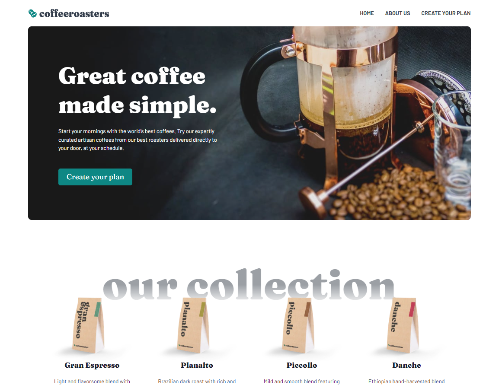

# Frontend Mentor - Coffeeroasters subscription site solution

This project comes from the [Coffeeroasters subscription site challenge on Frontend Mentor](https://www.frontendmentor.io/challenges/coffeeroasters-subscription-site-5Fc26HVY6). It has been altered to provide improved interpretation of vertical rhythm and typescale principles in the design.

## Table of contents

- [Frontend Mentor - Coffeeroasters subscription site solution](#frontend-mentor---coffeeroasters-subscription-site-solution)
  - [Table of contents](#table-of-contents)
  - [Overview](#overview)
    - [Screenshot](#screenshot)
  - [Built with](#built-with)
  - [Author](#author)

## Overview

This is a design-to-code project to showcase products in a subscription-based e-commerce site. The featured functionality is a form containing your options when setting up the subscription, up until the point of starting a "checkout" process. For the the purposes of this project, the checkout will simply reset the options. Persistant state on refresh with Local Storage is provided.

Users should be able to:

- View the optimal layout for each page depending on their device's screen size
- See hover states for all interactive elements throughout the site
- Make selections to create a coffee subscription and see an order summary modal of their choices
  - Once the user selects the "Checkout" button on the modal, a confirmation toast appears, and the selections reset to the default values.

### Screenshot

Live Site URL: [https://coffeeroaster-subs.vercel.app/](https://coffeeroaster-subs.vercel.app/)

## Built with

- [Chakra UI](https://www.chakra-ui.com) CSS-in-JS UI component library with accessibility standards
- [NextJS](https://nextjs.org/) - React Meta framework
- Mobile-first workflow
- TypeScript

## Author

- Website - [Tyler Pfledderer](https://tylerpweb.dev)
- Linkedin - [https://linkedin.com/in/tyler-pfledderer](https://linkedin.com/in/tyler-pfledderer)
